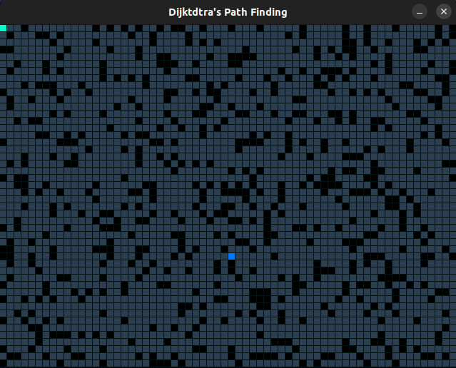
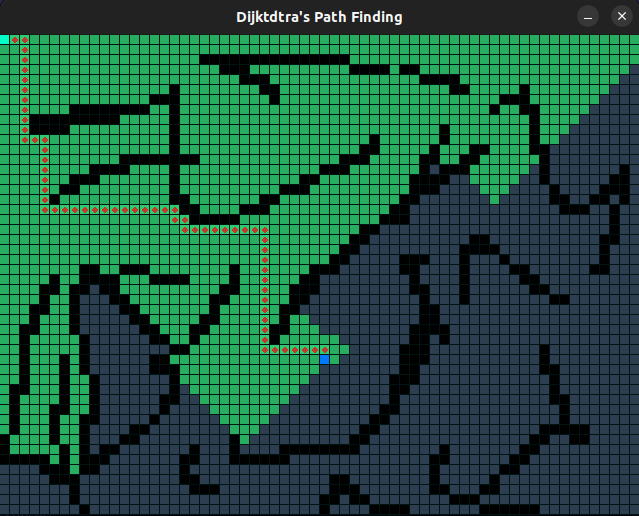
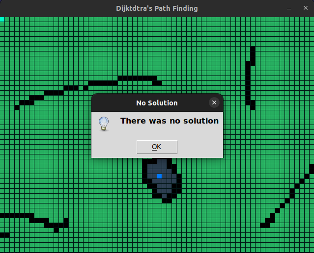

# Dijkstra Path Find

**Conteúdo da Disciplina**: Grafos 2<br>

## Alunos
|Matrícula | Aluno |
| -- | -- |
| 17/0101711  |  Daniel Barcelos Moreira |

## Sobre 
Demonstra a visualização do menor caminho utilizando o algoritmo de dijkstra.

## Apresentação

A apresentação pode ser acessada no seguinte [link](https://youtu.be/gXPv9BdwaU8).

## Screenshots

</figcaption>
    Imagem 1: Tela inicial
</figcaption>


</figcaption>
    Imagem 2: Mostrando menor caminho
</figcaption>


</figcaption>
    Imagem 3: Trajeto sem solução
</figcaption>

## Instalação 
**Linguagem**: Python<br>
**Framework**: Pygame<br>
Descreva os pré-requisitos para rodar o seu projeto e os comandos necessários.

## Uso 
- Instale o [python 3](https://www.python.org/downloads/);
- Instale o [pygame](https://pygame-zero.readthedocs.io/en/1.1/installation.html);
- Instale o [tkinter](https://tkdocs.com/tutorial/install.html#install-x11-python);

```
python3 dijkstra.py
```
- Para encontrar o menor caminho basta apertar a tecla `ENTER`
## Outros
- Para inserir as paredes manualmente com o mouse vá até a linha 32 do código e insira `self.parede = False`.

- Referência do projeto [Link](https://www.youtube.com/watch?v=3yUPeIayvfU)


